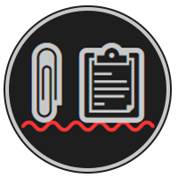
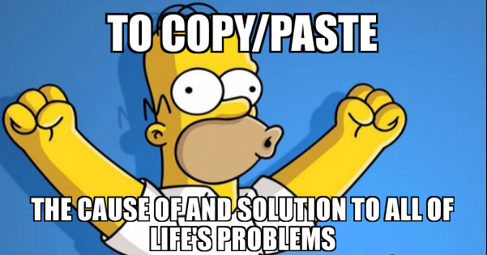

# CopyThat

A clipboard monitoring tool written in RUST linked to C# for cross platform clipboard monitoring.



# RUST

`./lib`

Why rust, well there is simply NO good way to handle this in dotnet using both linux and windows.

The clipboard library is a background thread that monitors your clipboard, as text is copied it delgates this text to a function pointer.
This function is linked to out C# library.

# Build Steps

- Install RUST https://www.rust-lang.org/learn/get-started
- Navigate to the `./lib/clipboard` directory
- Execute `cargo build --release` to generate a `clipthat_clipboard.dll` located in the `./clipboard/target/release` directory

Once compiled the library should be added to the C# code as an embedded resource and dynamically linked. See the C# solution for details.

*note you will not be able to build the CSharp librarys until the RUST binary is created*

# CSHARP

`./pkg`

Assuming you have complied the Rust library you dontnet solution should have no errors.
The `CopyThat` project is a library that gets packed to a nuget. This library is fairly simply and just links into the RUST binary.
The RUST library is added to the project with a relative path so its recreated everytime the RUST project is compiled.

An example console application have been provided `CopyThat.Example`

# Useage

Create a new clipboard using the `ClipboardFactory`. Currently there are two different clipboards,
one running a managed thread in Rust and another that runs on a CSharp thread. While the Rust thread is faster and more efficient
it can produce exceptions when invoked from certain contexts.

Create a new `Clipboard` object providing a `Action<string, Exception>` used to delegate any errors to the consumer

```csharp
var clipboard = new ClipboardFactory()
    .WithForegroundProcessing(TimeSpan.FromMilliseconds(200))
    .Build((method, error) =>
{
    Console.WriteLine($"Error From {method}: {error?.Message}");
});
```

or

```csharp
var clipboard = new ClipboardFactory()
    .WithBackgroundProcessing()
    .Build((method, error) =>
{
    Console.WriteLine($"Error From {method}: {error?.Message}");
});
```

The clipboard class is `Disposable` so you can wrap it inside a using state to stop monitoring the clipboard.

```csharp
using var clipboard = new ClipboardFactory()
    .WithForegroundProcessing(TimeSpan.FromMilliseconds(200))
    .Build();
```

Once created the `clipboard.StartMonitoringClipboard(textReceived => {});` method should be called to start watching for changes.

```csharp
var clipboard = new Clipboard((message, error) =>
{
    // Process Error Here
});

clipboard.StartMonitoringClipboard(text =>
{
    Console.WriteLine($"CLIPBOARD TEXT RX: \n{text}");
});
```

You can also send text to the clipboard.

_please note you should be carful based on the useage,
sending text to the clipboard will also invokde the monriting and execute the text recevied callback.  
This could create an endless loop if not handled_

```csharp
clipboard.SetClipboardText(data);
```

When the monitor is disposed the callback with stop sending data to the application.

```csharp
clipboard.Dispose();

```

You can also manually poll the clipboard without starting the monitor.

```csharp
var clipboard = new Clipboard((message, error) =>
{
    // Process Error Here
});

var polledText = clipboard.PollClipboard();

if (!string.IsNullOrEmpty(polledText))
{
    Console.WriteLine($"Polled Keyboard Text: \n", polledText);
}

```
